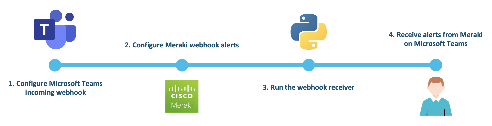
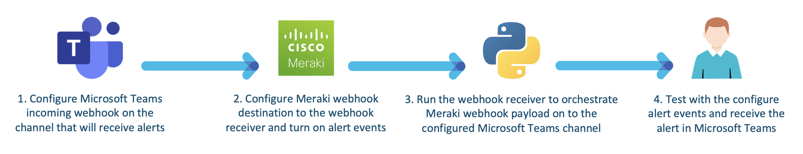

# Meraki Alerts to Microsoft Teams

A simple Meraki webhook receiver that orchestrates alerts to Microsoft Teams. Alerts from Meraki webhook will be parsed and displayed as an adaptive card in the Microsoft Teams channel.

---

The following diagram describes the high-level workflow.



The following diagram describes the PoV high level design.




## Contacts
* Alvin Lau (alvlau@cisco.com)
* Felix H Y Lam (flam1@cisco.com)


## Solution Components
* Meraki devices
* Meraki webhooks
* Microsoft Teams
* Python 3.7


## Prerequisite
- **Configure Incoming Webhook in Microsoft Teams**
  1. Open Microsoft Teams and go to the designated channel.
  2. In top right corner select "More options" (...), then click "Connectors".
  3. Find "Incoming Webhook" and click "Configure".
  4. Provide the connector a name and an icon (optional), then click "Create".
  5. Copy the URL and paste it in .env file.

- **ngrok** - this is used to expose local http server to a public address so the Slack Bot can connect to the script running locally. Follow the [ngrok download page](https://ngrok.com/download) to set it up.


## Installation

1. Download this repository, or clone this repository by `git clone <this repo>`.

2. Optionally, create a Python 3 virtual environment.
```
python3 -m venv venv
source venv/bin/activate
```

3. Install the dependencies.
```
pip install -r requirement.txt
```

4. Run the webhook receiver.
```
python server.py
```

5. In another terminal, use ngrok to get a public address.
```
ngrok http 5000
```

6. Copy the HTTPS URL in ngrok and set up Meraki webhook.
   - Open Meraki Dashboard and go to Network-wide -> Alerts.
   - Under Webhooks section, click "Add an HTTP server".
   - Provide a name, paste the ngrok HTTPS URL, create a shared secret (optional) and pick "Meraki" as payload template.
   - Under Alerts Settings section, check the alert type to be received and add the newly configured webhook.
   - Save the settings.

7. You can start testing and you should receive messages in the configured Microsoft Teams channel.


## License
Provided under Cisco Sample Code License, for details see [LICENSE](./LICENSE)


## Code of Conduct
Our code of conduct is available [here](./CODE_OF_CONDUCT.md)


## Contributing
See our contributing guidelines [here](./CONTRIBUTING.md)
